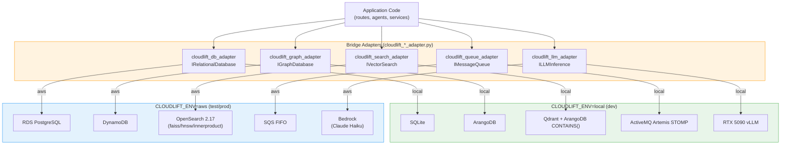
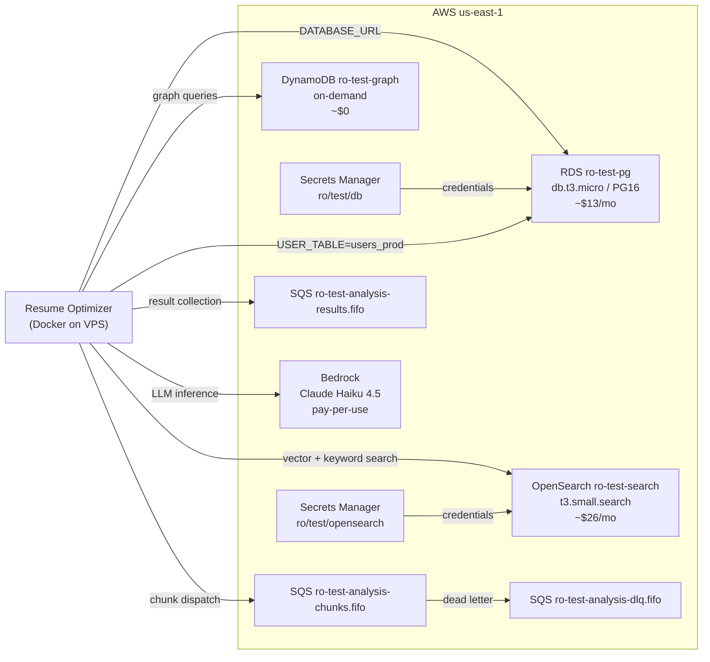
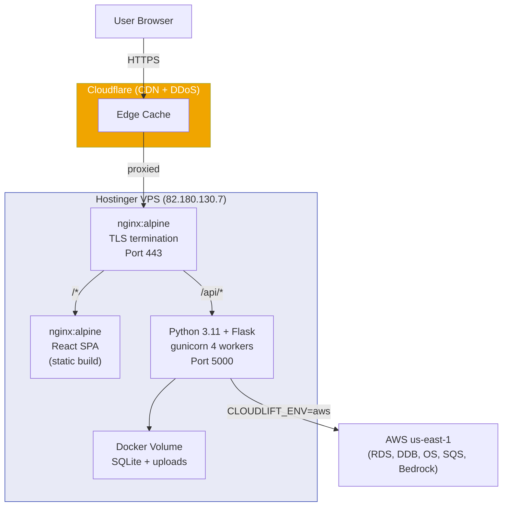
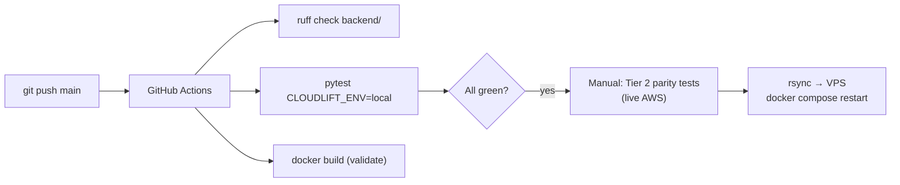

# Architecture: CloudLift Bridge Adapter Pattern

## Overview

Resume Optimizer uses the **bridge adapter pattern** introduced by [CloudLift](https://github.com/mvogt99/cloudlift) to decouple application code from the underlying service implementations. A single environment variable (`CLOUDLIFT_ENV`) routes all service calls to either local or cloud backends — no code changes required.

---

## Bridge Adapter Pattern

---

## Service Mapping Detail

| Contract Interface | Local Adapter | AWS Adapter | Notes |
|---|---|---|---|
| `IRelationalDatabase` | SQLite (via db_engine.py) | RDS PostgreSQL db.t3.micro | `cloudlift_db_adapter.resolve_database_url()` fetches credentials from Secrets Manager |
| `IGraphDatabase` | ArangoDB localhost:8529 | DynamoDB `ro-test-graph` | Single-table design, 4 GSIs for traversal; `get_graph_client()` factory |
| `IVectorSearch` | Qdrant localhost:6333 | OpenSearch managed domain | 384-dim cosine (all-MiniLM-L6-v2); `post_filter` for user-scoped search |
| `IMessageQueue` | Artemis STOMP localhost:61613 | SQS FIFO `ro-test-analysis-*.fifo` | 3 queues: chunks, results, DLQ |
| `ILLMInference` | vLLM localhost:8021 (smart_llm.py) | Bedrock Claude Haiku | Task-type routing (analysis→Haiku, reasoning→Sonnet) |

---

## AWS Resource Map

**Total AWS cost:** ~$39/mo (RDS $13 + OpenSearch $26; DynamoDB/SQS/Bedrock are pay-per-use at near-zero test scale)

---

## Environment-Specific User Tables

All three environments that use PostgreSQL share the same RDS instance but use **separate user tables** to prevent cross-environment user pollution:

| Environment | `USER_TABLE` env var | Table on RDS |
|---|---|---|
| Dev (SQLite) | `users` | `users` (SQLite, isolated by file) |
| Docker AWS test | `users_test` | `users_test` on `ro_test` DB |
| Production VPS | `users_prod` | `users_prod` on `ro_test` DB |

---

## OpenSearch Index Design

Three vector indices (384-dim cosine, all-MiniLM-L6-v2, faiss/hnsw/innerproduct):
- `ro_resumes` — resume text chunk embeddings
- `ro_job_descriptions` — job description embeddings
- `ro_skills_taxonomy` — canonical skill name embeddings

Three keyword indices (BM25 full-text):
- `ro_graph_client_projects` — project vertex data
- `ro_graph_ai_skills` — AI skills vertex data
- `ro_graph_journey_milestones` — journey milestone data

User-scoped search uses `post_filter` on `metadata.user_id.keyword` (dynamic field mapped as text, requiring `.keyword` for exact match).

---

## DynamoDB Graph Schema

Single-table design (`ro-test-graph`):

| Key | Format | Purpose |
|---|---|---|
| `pk` | `vertex#{collection}` or `edge#{collection}` | Entity type |
| `sk` | SHA-1 hex of key source | Deterministic dedup |
| GSI `gsi1-user-collection` | PK=user_id, SK=collection | User-scoped vertex queries |
| GSI `gsi2-from-edge` | PK=from_id, SK=edge_collection | OUTBOUND traversal |
| GSI `gsi3-to-edge` | PK=to_id, SK=edge_collection | INBOUND traversal |
| GSI `gsi4-collection-key` | PK=collection, SK=sk | Collection scan / count |

Floats are stored as `Decimal` (DynamoDB requirement) and converted back on read.

---

## Deployment Topology

**nginx routes:**
- `/*.well-known/acme-challenge/` → Certbot (Let's Encrypt renewal)
- `/api/*` → Flask backend container
- `/*` → React SPA (nginx static file server)

---

## CI/CD Pipeline

Tier 2 parity tests (hitting live RDS, OpenSearch, DynamoDB) run on-demand before production deploys — they cost real AWS money and aren't run in CI.
