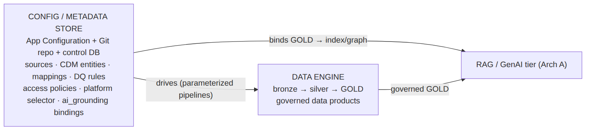
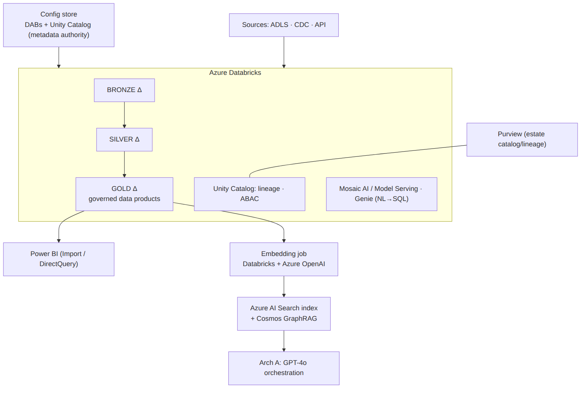
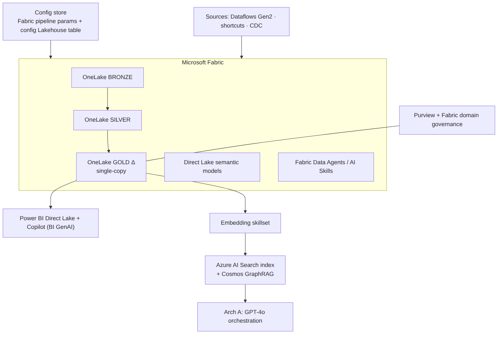
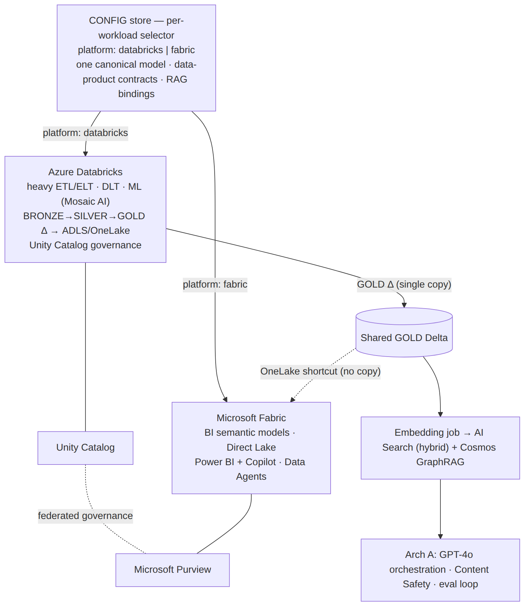

# Config-Driven Data Platform × RAG/GenAI on Azure — Three Variants
**Part 2 of 2** · Databricks · Microsoft Fabric · Hybrid · 2026-06-17

> Companion: `Azure_RAG_GenAI_reference_architecture_2026-06-17.md` (the GenAI/RAG core, "Arch A").
> Here the RAG/GenAI tier is grounded on **governed GOLD data products** produced by a
> **configuration-driven** data platform. Three deployment shapes; one canonical config model.

---

## 1. The configuration-driven idea (one control model, swappable engines)

The platform is **metadata-first**: pipelines are generic and parameterized — they *read config and
execute* rather than carrying per-source bespoke code. This is your PwC **canonical configuration
metadata model** (Data-as-a-Product) expressed in cloud, and it mirrors two things you already run
locally: the **harness-recipes** "canonical recipes" registry and CloudLift's **contract-driven
adapters / bridge-adapter / multi-cloud-portability** spine (CoE patterns `contract-driven-adapters`,
`multi-cloud-portability`).

```
                 ┌──────────────────────────────────────────────────────────┐
   CONTROL PLANE │  CONFIG / METADATA STORE                                  │
   (config-      │  • sources, canonical entities (CDM), mappings            │
    driven)      │  • transformations, data-product defs, quality rules      │
                 │  • access policies, AI-grounding bindings                 │
                 │  • per-workload  platform: databricks | fabric  selector  │
                 │  Azure App Configuration + Git config repo + control DB    │
                 └───────────────┬──────────────────────────────┬───────────┘
                                 │ drives                        │ binds
                 ┌───────────────▼───────────────┐   ┌───────────▼───────────────────┐
   EXECUTION     │  DATA ENGINE (Variant 1/2/3)   │   │  RAG/GENAI TIER ("Arch A")     │
                 │  bronze → silver → GOLD        │──►│  embed GOLD → AI Search index  │
                 │  governed data products        │   │  + GraphRAG (Cosmos) → GPT-4o  │
                 └────────────────────────────────┘   └────────────────────────────────┘
```



**Key principle:** the config declares *which governed GOLD tables/semantic models become which AI
Search indexes / GraphRAG sets*. Swapping the engine (Databricks ↔ Fabric) changes execution, **not**
the canonical model, the data-product contracts, or the RAG bindings.

---

## 2. Variant 1 — Databricks Lakehouse

Best when **data engineering and ML scale dominate**. (This is your real SPR POC outcome — Databricks
selected for engineering/ML fit.)

```
 CONFIG STORE ──(DABs / job params; Unity Catalog = metadata authority)──┐
                                                                          ▼
 SOURCES → ┌─────────────────── Azure Databricks ───────────────────────────────┐
  ADLS/    │ DLT / PySpark pipelines (generic, config-parameterized)             │
  CDC/API  │  BRONZE Δ ──► SILVER Δ ──► GOLD Δ  (Delta Lake, medallion)          │
           │  Unity Catalog: lineage · row/column ABAC · governed data products  │
           │  Mosaic AI / Model Serving (OSS + feature serving) · Genie (NL→SQL)  │
           └───────────────┬───────────────────────────────────────┬────────────┘
                           │ GOLD Δ                                 │ embeddings job
                           │                                        │ (Databricks + Azure OpenAI)
              ┌────────────▼─────────────┐               ┌──────────▼─────────────┐
              │ Power BI (Import/DirectQ) │               │  Azure AI Search index │──► Arch A
              └───────────────────────────┘               │  + Cosmos GraphRAG     │   (GPT-4o,
                                                           └────────────────────────┘    orchestr.)
 GOVERNANCE: Unity Catalog (primary) + Purview (estate catalog/lineage) · Content Safety on AI tier
```


- **Config → execution:** Databricks Asset Bundles + job parameters; pipelines read config tables.
- **Governance authority:** Unity Catalog (lineage, ABAC, data products) federated into Purview.
- **RAG binding:** GOLD Delta → scheduled embedding job → AI Search; optional **Databricks Vector
  Search** if you want the vector index co-located with the lakehouse.
- **AI:** Azure OpenAI for generation; **Mosaic AI / Model Serving** for OSS/fine-tuned (your vLLM
  analogue); Genie/AI-BI for NL-to-SQL on governed gold.

---

## 3. Variant 2 — Microsoft Fabric

Best when the estate is **BI-led / Power BI-centric** and a unified SaaS analytics surface with low
ops overhead is the mandate.

```
 CONFIG STORE ──(Fabric pipeline params + config Lakehouse table)──┐
                                                                    ▼
 SOURCES → ┌────────────────────── Microsoft Fabric ──────────────────────────────┐
  Dataflows│ Data Pipelines / Dataflows Gen2 / Spark notebooks (config-driven)      │
  Gen2 /   │  OneLake:  BRONZE ──► SILVER ──► GOLD  (Delta, single-copy storage)    │
  shortcuts│  Direct Lake semantic models · Fabric Data Agents / AI Skills          │
           │  Purview-backed governance, sensitivity labels, lineage                │
           └───────────────┬───────────────────────────────────────┬───────────────┘
                           │ GOLD (OneLake Δ)                       │ embedding skillset
              ┌────────────▼─────────────┐               ┌──────────▼─────────────┐
              │ Power BI Direct Lake +   │               │  Azure AI Search index │──► Arch A
              │ Copilot (BI-side GenAI)  │               │  + Cosmos GraphRAG     │   (GPT-4o,
              └───────────────────────────┘               └────────────────────────┘    orchestr.)
 GOVERNANCE: Purview + Fabric domain governance · Content Safety on AI tier
```


- **Config → execution:** metadata-driven Fabric Data Pipelines / Dataflows Gen2; a config Lakehouse
  table parameterizes notebooks and pipelines.
- **Serving:** **Direct Lake** semantic models give business users live gold; **Power BI Copilot**
  handles BI-side NL questions.
- **RAG binding:** OneLake GOLD (Delta) → AI Search index (embedding skillset) → Arch A; app-side
  GenAI via AI Foundry agent grounded on the same gold + semantic model.

---

## 4. Variant 3 — Hybrid (the showcase: config picks the engine per workload)

Databricks does the **heavy engineering/ML**; Fabric provides the **BI/serving/semantic layer** —
over **one copy** of the data (OneLake shortcuts to the Databricks Delta, no duplication). The
config's `platform:` selector routes each workload to the right engine. This is the literal
"configuration-driven" outcome you asked for.

```
 CONFIG STORE ── per-workload selector:  platform: databricks | fabric ──┐
        │ canonical entities · data-product contracts · RAG bindings     │
        ▼ (one canonical model, two engines)                             ▼
 ┌──────────────── Azure Databricks ────────────────┐      ┌──────── Microsoft Fabric ─────────┐
 │ heavy ETL/ELT · DLT · ML (Mosaic AI)              │      │ BI semantic models · Direct Lake  │
 │ BRONZE Δ ─► SILVER Δ ─► GOLD Δ  (writes to ADLS/  │      │ Power BI + Copilot · Data Agents  │
 │ OneLake; Unity Catalog governance)                │      │ Dataflows Gen2 for light marts    │
 └───────────────┬───────────────────────────────────┘      └───────────────┬───────────────────┘
                 │  GOLD Δ (single copy)         OneLake SHORTCUT ◄───────────┘ (no data movement)
                 ▼
        ┌────────────────────────────────────────────────────────┐
        │ Embedding job → Azure AI Search (hybrid) + Cosmos GraphRAG│──► Arch A (GPT-4o orchestration,
        └────────────────────────────────────────────────────────┘     Content Safety, eval loop)
 GOVERNANCE (federated): Unity Catalog ⟷ Purview  (lineage + ABAC across both engines)
```


- **Single source of truth:** Databricks writes governed Delta once; Fabric reads it via **OneLake
  shortcuts** — no copy, no drift. RAG grounds on that same gold.
- **Federated governance:** Unity Catalog (engineering/ML) + Purview (estate-wide catalog/lineage);
  ABAC/sensitivity propagates to the AI Search index.
- **Why it wins:** business users get Fabric/Power BI simplicity; data scientists get Databricks
  scale; the GenAI tier grounds on one governed copy — and the **config decides per workload**,
  so adding a source or a use case is a config change, not a re-platforming.

---

## 5. Canonical config example (engine-agnostic; drives all three variants)

```yaml
data_product:
  name: pbm_claims_gold
  canonical_entity: Claim            # maps to the CDM, not a source schema
  platform: databricks               # databricks | fabric  (Variant 3 selector)
  sources:
    - id: adjudication_api
      mapping: mappings/claim_from_adjudication.yml
    - id: eligibility_files
      mapping: mappings/claim_from_eligibility.yml
  transforms: [dedupe, conform_dimensions, scd2]
  quality_expectations:               # gate before GOLD is published
    - not_null: [claim_id, member_id, service_date]
    - row_count_delta_pct: 15
  governance:
    classification: PHI               # Purview label; controls who/what can index it
    access: abac(role in [analyst, ai_grounding_svc])
  ai_grounding:                       # <-- the binding to Arch A
    enabled: true
    index: aisearch://claims-rag
    graph: cosmos://claims-graph
    chunk: {strategy: semantic, max_tokens: 800}
    embed_model: text-embedding-3-large
    refresh: on_gold_publish
```
Flip `platform: fabric` and the *same* declaration executes on Fabric pipelines/OneLake; the
`ai_grounding` binding to Arch A is unchanged. That invariance **is** the configuration-driven design.

---

## 6. When to pick which (decision guide)

| Driver | Databricks (V1) | Fabric (V2) | Hybrid (V3) |
|---|---|---|---|
| Center of gravity | data engineering / ML at scale | BI-led, Power BI-centric, SaaS-simple | both, at scale |
| Team | data engineers, ML engineers | analysts, BI devs, business users | mixed org |
| Ops overhead | higher (clusters, tuning) | lowest (SaaS) | medium |
| Advanced ML / OSS models | strongest (Mosaic AI / Model Serving) | lighter (AI Skills / Copilot) | strongest (on the DBX side) |
| Governance authority | Unity Catalog (+ Purview) | Purview (+ Fabric domains) | federated UC ⟷ Purview |
| RAG grounding source | GOLD Delta | OneLake GOLD | one shared GOLD (shortcut) |
| Typical "right answer" | ML-heavy modernization | BI/semantic modernization | most large enterprises |

**The mature line (use it in the 3Cloud interview):** *"It's rarely either/or — Variant 3 is where
most enterprises land: Databricks for engineering and ML, Fabric for the BI/semantic layer over one
OneLake copy, and the GenAI tier grounded on that single governed gold. I drive the engine choice
from the client's center of gravity, and I keep it a configuration decision so it stays reversible —
which is exactly the Fabric-vs-Databricks POC I ran where the data pointed to Databricks."*

---

## 6b. Cost & sizing per variant (illustrative, USD/month)

> This is the **data-platform engine cost**, *on top of* the RAG/GenAI core (see Part 1 §4b).
> Order-of-magnitude — validate with the Azure Pricing Calculator + real DBU/capacity telemetry.

| | Small | Medium | Large | Primary cost driver & levers |
|---|---|---|---|---|
| **V1 Databricks** | $500–2K | $3–10K | $15–50K+ | **DBU + cluster VMs.** Levers: serverless SQL, Photon, autoscaling, spot, job (not all-purpose) clusters |
| **V2 Fabric** | F2–F4 ~$260–525 | F8–F16 ~$1–2.1K | F64+ ~$5–8.4K+ | **Capacity SKU (F-SKU).** F64 is the Copilot/AI threshold. Levers: 1-yr reservation (~–40%), pause non-prod capacity |
| **V3 Hybrid** | DBX small + F4 | DBX med + F8–F16 | DBX large + F32–F64 | Size **Fabric for *serving only*** (Databricks does the heavy engineering) — usually the cost-optimal shape at scale |

**Why Hybrid is often cheapest at scale:** you don't pay for a giant Fabric capacity to do heavy
ETL/ML (Databricks DBUs handle that elastically), and you don't duplicate storage (OneLake shortcut
to one Delta copy). You size Fabric purely to the BI/serving + Copilot need (often F8–F64), and let
Databricks autoscale/spot the engineering load. **Both engines read/write one governed GOLD copy**,
so there's no double-storage or double-pipeline cost — the config-driven model is also a
cost-control model.

---

## 7. CoE citations
Patterns/blueprints from `localhost:8000/api/architecture-coe`: `contract-driven-adapters`,
`multi-cloud-portability`, `bridge-adapter-pattern` (CloudLift spine — the config-driven backbone);
`rag-service`, `streaming-data-pipeline`, `document-processing-pipeline` (ingestion); `azure-openai-llm`,
`azure-blob-storage`, `azure-service-bus`, `azure-database-postgres`. Local grounding via the API
Documentation Hub (`localhost:8900`): vLLM, PersonaForge (hybrid retrieval), Qdrant, ArangoDB, FTAL
harness, CloudLift.
