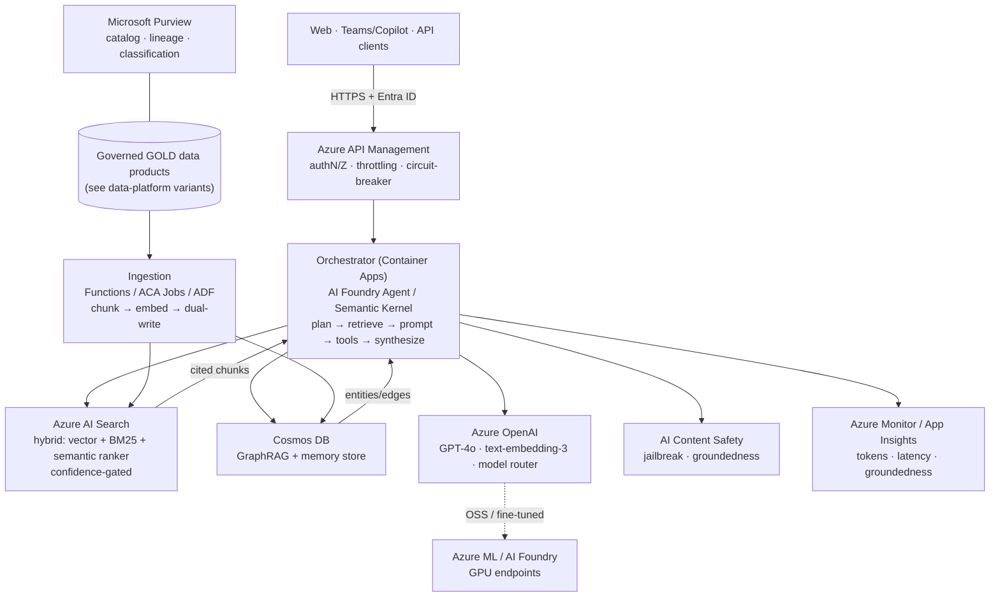
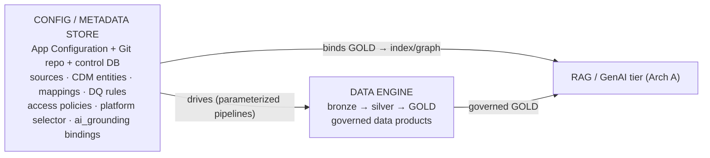
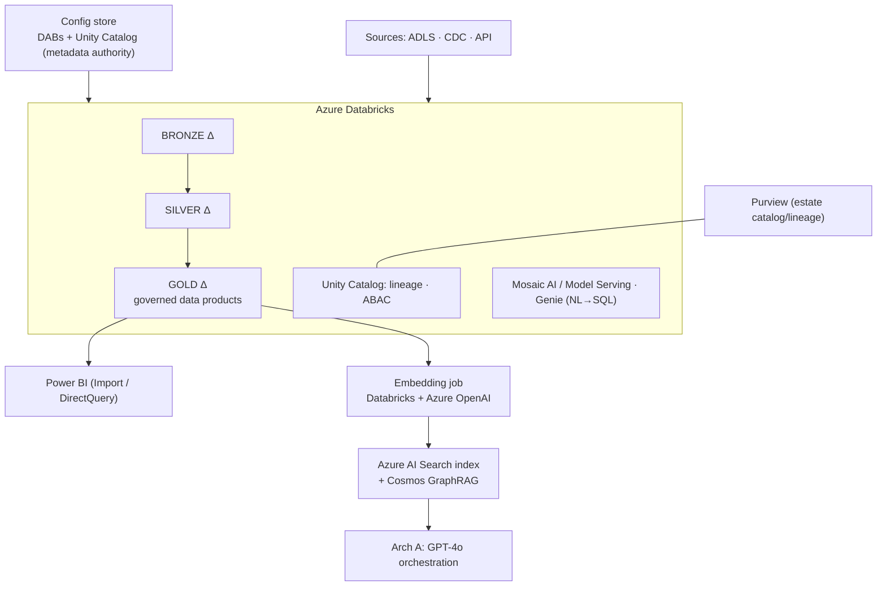
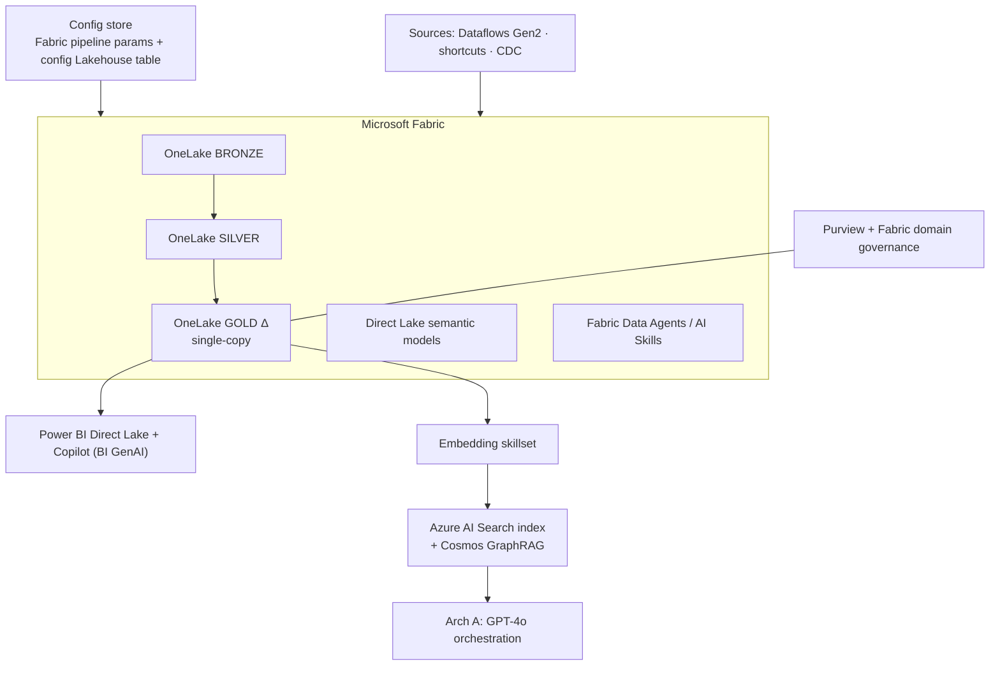
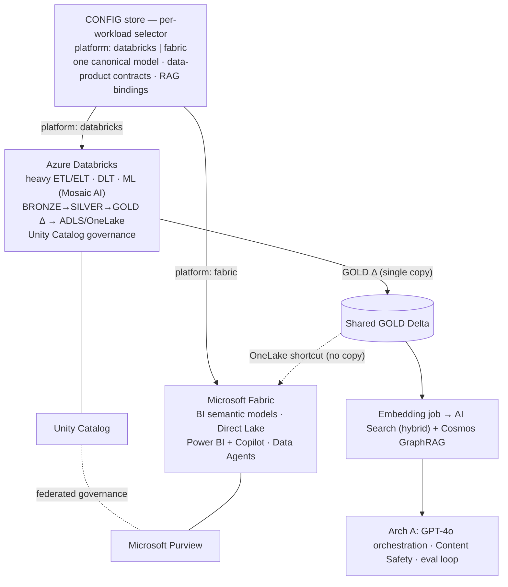

# Azure RAG/GenAI + Config-Driven Data Platform — Mermaid Diagrams
2026-06-17 · renders natively on GitHub, GitLab, Confluence (Mermaid plugin), VS Code, Obsidian.

> Source-of-truth diagrams for the two reference docs. Paste any block into a Mermaid renderer.
> ASCII equivalents live in `Azure_RAG_GenAI_reference_architecture_*.md` (Part 1) and
> `Azure_ConfigDriven_DataPlatform_variants_*.md` (Part 2).

---

## 1. Arch A — Production RAG / GenAI on Azure



---

## 2. Configuration-driven control model (one config, swappable engines)



---

## 3. Variant 1 — Databricks Lakehouse



---

## 4. Variant 2 — Microsoft Fabric



---

## 5. Variant 3 — Hybrid (config picks the engine per workload)



---

## 6. Render notes
- GitHub/GitLab/Obsidian render ```` ```mermaid ```` fences automatically.
- Confluence: use the *Mermaid Diagrams* macro/app, or convert with the Mermaid CLI
  (`mmdc -i file.md -o out.png`) for static images.
- These are intentionally simplified vs. the ASCII versions (whiteboard-friendly); the ASCII docs
  carry the full cross-cutting detail (security, governance, eval loop, data flows).
