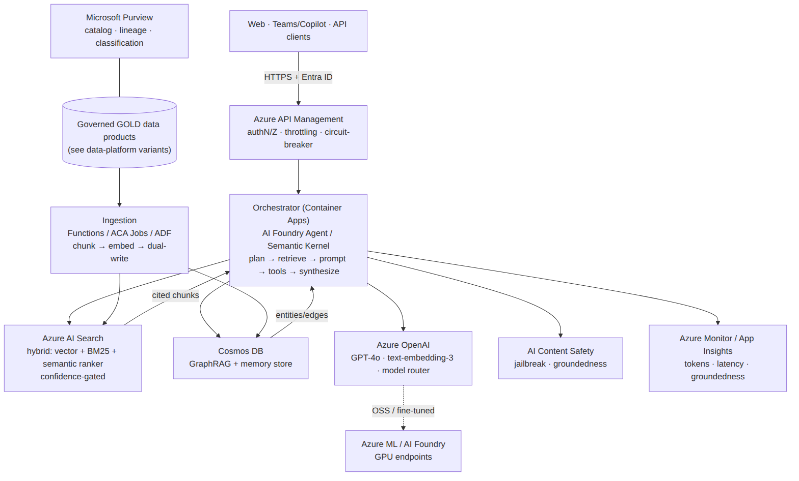

# Production RAG / GenAI on Azure — Reference Architecture
**Part 1 of 2** · grounded in the existing local hybrid-AI stack · 2026-06-17

> Companion: `Azure_ConfigDriven_DataPlatform_variants_2026-06-17.md` (Databricks / Fabric / Hybrid).

This reference is derived from your **actual running local architecture** (discovered via the API
Documentation Hub at `localhost:8900` and the Architecture CoE knowledge base at `localhost:8000`),
then mapped to managed Azure services. It is not generic — every Azure component below has a
working local analogue you already operate.

---

## 0. What the local stack already proves (the credibility anchor)

Your hybrid-AI platform is, in effect, a self-hosted production RAG/GenAI system. Inventory from
the live service catalog:

| Local service (port) | What it does | This is the analogue of… |
|---|---|---|
| **vLLM on RTX 5090** (8021) | OpenAI-compatible inference (`/v1/chat/completions`) | a managed model-serving endpoint |
| **FTAL harness** — gateway data plane (8001) | model routing/swap, benchmarking, scoring, capability scan | a model router + evaluation harness |
| **PersonaForge** (8090) | **hybrid retrieval (document + vector + graph), weighted scoring, confidence thresholds, memory CRUD, governance runs, context compilation** | the RAG orchestration + memory tier |
| **Qdrant** (6333) | dense vector store | the vector index |
| **ArangoDB** (`ro_*` collections, named graph) | knowledge graph + GraphRAG | the graph store |
| **Embedding service** (all-MiniLM-L6-v2, 384-dim) | text → vectors | the embeddings model |
| **Gateway control plane** (8000) | API, web UI, request proxying, **circuit breakers** | API gateway + resilience |
| **CloudLift** (8080) | agentic deploy orchestrator — Celery+Beat, WebSocket streaming, **STS AssumeRole BYOC, multi-region**, bridge-adapter spine | IaC + deployment control plane |
| **harness-recipes** (8000) | **canonical, config-driven task recipes** | the configuration/contract registry |
| **resume-optimizer** (5000) | the consuming application | the business app |

The platform's signature moves — **control-plane / data-plane split, hybrid vector+graph retrieval
with confidence gating, human-in-the-loop memory governance, dual-write, circuit breakers, and
contract-/config-driven adapters (CloudLift)** — are exactly the production concerns this Azure
reference encodes.

---

## 1. Local → Azure mapping (the Rosetta stone)

| Local | Azure (managed, production) |
|---|---|
| vLLM (OpenAI-compatible) | **Azure OpenAI Service** (GPT-4o, o-series) via **Azure AI Foundry**; OSS/fine-tuned models via **AI Foundry serverless** or **Azure ML managed online endpoints (GPU)** |
| FTAL harness routing + scoring | **AI Foundry model router** + **Prompt Flow evaluations**; **API Management** for throttling/keys; **Azure ML pipelines** for offline benchmarking |
| PersonaForge hybrid retrieval | **Azure AI Search** (vector + BM25 + **semantic ranker** = hybrid) as the retrieval core; orchestration in **Semantic Kernel / AI Foundry Agent Service** |
| Embedding service | **Azure OpenAI `text-embedding-3-large/small`** |
| Qdrant | **Azure AI Search vector profiles** (or Qdrant on AKS/ACA if a dedicated engine is required) |
| ArangoDB graph / GraphRAG | **Azure Cosmos DB** (Gremlin or NoSQL) + **AI Search** for the GraphRAG index |
| Memory store + governance | **Cosmos DB** (memory items) + **Content Safety** + HITL review queue |
| Gateway control plane | **API Management** + **Azure Container Apps** (or AKS) |
| Gateway data plane (heavy/async) | **AKS / Container Apps** + **Azure Service Bus** + **KEDA** autoscale |
| CloudLift deploy spine | **Container Apps Jobs / AKS** + **Service Bus** + **Managed Identity** + **Bicep/Terraform** + **SignalR** (WebSocket streaming) |
| harness-recipes (config registry) | **Azure App Configuration** + a **config Git repo** (the config-driven backbone — see Part 2) |
| Circuit breakers / capability scan | **APIM policies** + **Azure Monitor** health + **Defender for Cloud** |
| App relational store (`db_engine`/`DATABASE_URL`) | **Azure Database for PostgreSQL Flexible Server** |
| App object/doc storage | **ADLS Gen2 / Blob** + **Cosmos DB** |

---

## 2. Reference Architecture A — Production RAG / GenAI on Azure

```
                              ┌──────────────────────────────────────────────┐
   EXPERIENCE                 │  Web app · Teams/Copilot · API consumers       │
                              └───────────────┬────────────────────────────────┘
                                              │ HTTPS (Entra ID auth)
                              ┌───────────────▼────────────────────────────────┐
   EDGE / GATEWAY             │  Azure API Management  (authN/Z, throttling,    │
                              │  keys, request shaping, circuit-breaker policy) │
                              └───────────────┬────────────────────────────────┘
                                              │
                              ┌───────────────▼────────────────────────────────┐
   ORCHESTRATION             │  AI Foundry Agent Service / Semantic Kernel app  │
   (Container Apps)          │  query plan → retrieve → assemble prompt →       │
                             │  tool/function calls → synthesize → guard        │
                             └───┬───────────────┬──────────────────┬───────────┘
                                 │               │                  │
            ┌────────────────────▼──┐   ┌────────▼─────────┐  ┌─────▼──────────────┐
   RETRIEVAL│ Azure AI Search       │   │ Cosmos DB        │  │ Azure OpenAI       │ MODEL
            │ hybrid: vector + BM25 │   │ GraphRAG (graph) │  │ GPT-4o generation  │
            │ + semantic ranker     │   │ + memory store   │  │ text-embedding-3   │
            │ (confidence gated)    │   └──────────────────┘  │ + model router     │
            └───────────┬───────────┘                         └─────┬──────────────┘
                        │  grounding chunks + citations              │  OSS/FT models →
                        │                                            │  Azure ML / AI Foundry
   ┌────────────────────▼─────────────────────────────────────┐     │  GPU endpoints
   │ INGESTION (Functions / ACA Jobs / ADF)                    │     │
   │ source → chunk → embed → upsert index + graph (dual-write)│◄────┘ (embeddings)
   │ incremental via change feed / event triggers              │
   └────────────────────┬─────────────────────────────────────┘
                        │ reads governed GOLD data products  (see Part 2)
   ┌────────────────────▼──────────┐   ┌───────────────────────────────────────────┐
   DATA  │ ADLS Gen2 (raw/docs)    │   │  GOVERNANCE & SAFETY (cross-cutting)        │
         │ Cosmos DB (memory/graph)│   │  • AI Content Safety (in/out, jailbreak)    │
         │ AI Search indexes       │   │  • Purview (catalog, lineage, classify)     │
         │ PostgreSQL (app state)  │   │  • Prompt Flow evals (groundedness/relevance)│
         └─────────────────────────┘   │  • prompt/response logging → Log Analytics  │
                                        │  • HITL review queue · Responsible AI gates │
   ┌────────────────────────────────┐  └───────────────────────────────────────────┘
   PLATFORM │ Key Vault · Managed Identity · Private Endpoints/VNet · Azure Monitor /
            │ App Insights (tokens, latency, groundedness) · Defender · Service Bus
   └────────────────────────────────────────────────────────────────────────────────┘
```



### Query path (runtime)
1. Client → **APIM** (Entra ID token, rate-limit, key) → **Orchestrator** (ACA).
2. Orchestrator runs the retrieval plan: **AI Search hybrid query** (vector + keyword + semantic
   re-rank) and, when the query is relational/entity-centric, a **GraphRAG** traversal in Cosmos —
   the same *document + vector + graph weighted* pattern PersonaForge uses, with a **min-confidence
   gate** (drop low-score grounding rather than hallucinate).
3. Retrieved, **cited** chunks + compiled context → **Azure OpenAI (GPT-4o)** for synthesis;
   the **model router** sends cheap/long-context or OSS workloads to the right deployment.
4. **Content Safety** screens input and output; **prompt/response + token + groundedness telemetry**
   stream to Log Analytics; low-confidence or policy-flagged answers route to the **HITL queue**.

### Ingestion path (build-time / incremental)
Source docs (Blob/ADLS) → chunk → **embed (text-embedding-3)** → **dual-write**: upsert vectors to
**AI Search** + entities/edges to the **Cosmos graph**. Triggered by change feed / events for
incremental freshness. Grounding sources are the **governed GOLD data products** from the data
platform (Part 2) — never raw, ungoverned data.

---

## 3. Cross-cutting concerns (the "production" in production RAG)

- **Security/network:** Entra ID (workload identities, no keys), Private Endpoints + VNet
  integration on AI Search / OpenAI / Cosmos / Storage, Key Vault for secrets, Defender for Cloud.
- **Governance/lineage:** **Microsoft Purview** catalogs and lineage-tracks every grounding source;
  classification/sensitivity labels propagate so PHI/PII never enters an index it shouldn't. (Your
  HIPAA/regulated background maps straight onto this.)
- **Safety:** **Azure AI Content Safety** (prompt-shield/jailbreak, groundedness detection,
  protected-material checks) on both directions; Responsible AI review gates = your HITL memory-review.
- **Evaluation loop:** offline **Prompt Flow / Azure ML evaluations** score groundedness, relevance,
  coherence, safety on a golden set — the managed analogue of the **FTAL harness benchmarking/scoring**.
- **Observability/cost:** App Insights traces per request (tokens in/out, latency, retrieval hit
  rate, groundedness); cost controls via model routing (route to cheapest sufficient model),
  caching, and PTU vs. pay-as-you-go sizing.
- **Resilience:** APIM circuit-breaker + retry/back-off, multi-region OpenAI with failover (mirrors
  your gateway circuit breakers and CloudLift multi-region/BYOC posture).

---

## 4. Architecture CoE citations (real artifacts from the local KB)

Grounded in the shop-wide Architecture CoE (`localhost:8000/api/architecture-coe`):
- **Blueprints:** `rag-service` (ingest→embed→vector→LLM; Azure topology = Functions + Cosmos +
  Blob + Azure OpenAI embeddings), `personaforge-agentic-memory`, `gpu-inference-service`,
  `conversational-ai-assistant`, `cloudlift-deployment-plane` (bridge-adapter spine).
- **Patterns:** `azure-openai-llm` (managed OpenAI on Azure), `qdrant-vector-search`,
  `managed-vector-search-opensearch`, `azure-blob-storage`, `azure-service-bus`,
  `azure-database-postgres`, `contract-driven-adapters`, `multi-cloud-portability`,
  `local-first-development`, `sts-assume-role-pattern`.
- **Contracts:** `ILLMInference`, `IDocumentDatabase`, `IObjectStorage`, `IMessageQueue`,
  `ICacheStore`, `IRelationalDatabase` — the adapter contracts that make the config-driven swap in
  Part 2 possible.
- **Decision (ADR):** `documentdb-no-aql-cosine-similarity` — informs the choice of a purpose-built
  vector engine (AI Search) over bolting cosine onto a doc store.

> Note: the CoE `advise` generator was briefly returning a vLLM parse error at authoring time, so
> this reference was grounded against the CoE `search` / `blueprints` / `patterns` endpoints
> directly. Re-run `POST /api/architecture-coe/advise` once vLLM parsing is healthy for the
> auto-generated bridge plan + cost envelope.

---

## 4b. Cost & sizing — RAG/GenAI core (illustrative, USD/month)

> Order-of-magnitude only — **validate with the Azure Pricing Calculator + real token volumes.**
> Unlike the CoE `rag-service` envelope ({50/150/500}, which is *compute-only* on AWS Lambda),
> production GenAI cost is **dominated by model tokens** (Azure OpenAI), then the search tier.

| Component | Small (pilot, <50K q/mo) | Medium (~500K q/mo) | Large (enterprise, multi-region) |
|---|---|---|---|
| Azure OpenAI (GPT-4o + embeddings) | $200–600 PAYG | $1.5–3K PAYG **or 1 PTU** | $8–30K+ **reserved PTUs** |
| Azure AI Search | Basic/S1 ~$75–250 | S1–S2 ~$250–1,000 | S2/S3 + replicas ~$2–6K |
| Cosmos DB (graph + memory) | serverless ~$25–100 | provisioned ~$200–800 | multi-region ~$1.5–5K |
| Compute (orchestrator) | ACA ~$50–150 | ACA scale ~$300–800 | AKS ~$1.5–4K |
| APIM | Developer/Consumption ~$50 | Standard ~$700 | Premium ~$3K+ |
| Safety + Monitor + Defender | ~$50 | ~$200 | ~$1K |
| **Approx. total** | **$450–1,200** | **$3–7K** | **$18–50K+** |

**Biggest knobs:** (1) **PTU vs. pay-as-you-go** for Azure OpenAI — reserve PTUs once volume is
steady; (2) **model routing** — send cheap/long-context work to smaller models (your FTAL-harness
routing pattern); (3) **caching** retrieval + frequent answers; (4) **AI Search tier/replicas**
sized to QPS + index size. Reservations (1-yr) cut OpenAI/Cosmos/compute ~30–40%.

---

## 5. Interview tie-in (3Cloud · Data & AI SME)

This doc doubles as live proof for two of the highest-probability 3Cloud technical questions:
- *"Architect a production RAG/GenAI app on Azure"* → walk Section 2 top-to-bottom; emphasize
  hybrid retrieval + confidence gating + Content Safety + Purview lineage + eval loop.
- *"How do you keep it grounded/safe in a regulated client?"* → Purview classification + Content
  Safety + HITL gates + private networking — tie to your HIPAA PBM (AWS) governance, noting the
  architecture is identical on Azure.
You can legitimately say: *"I run this exact pattern hands-on locally — vLLM inference, hybrid
vector+graph retrieval, governed memory with review gates — so the Azure managed version is a
mapping exercise, not a learning curve."*
