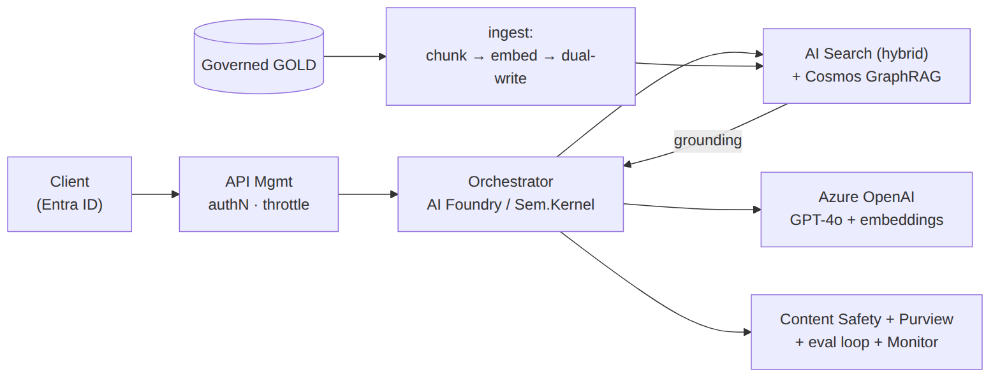
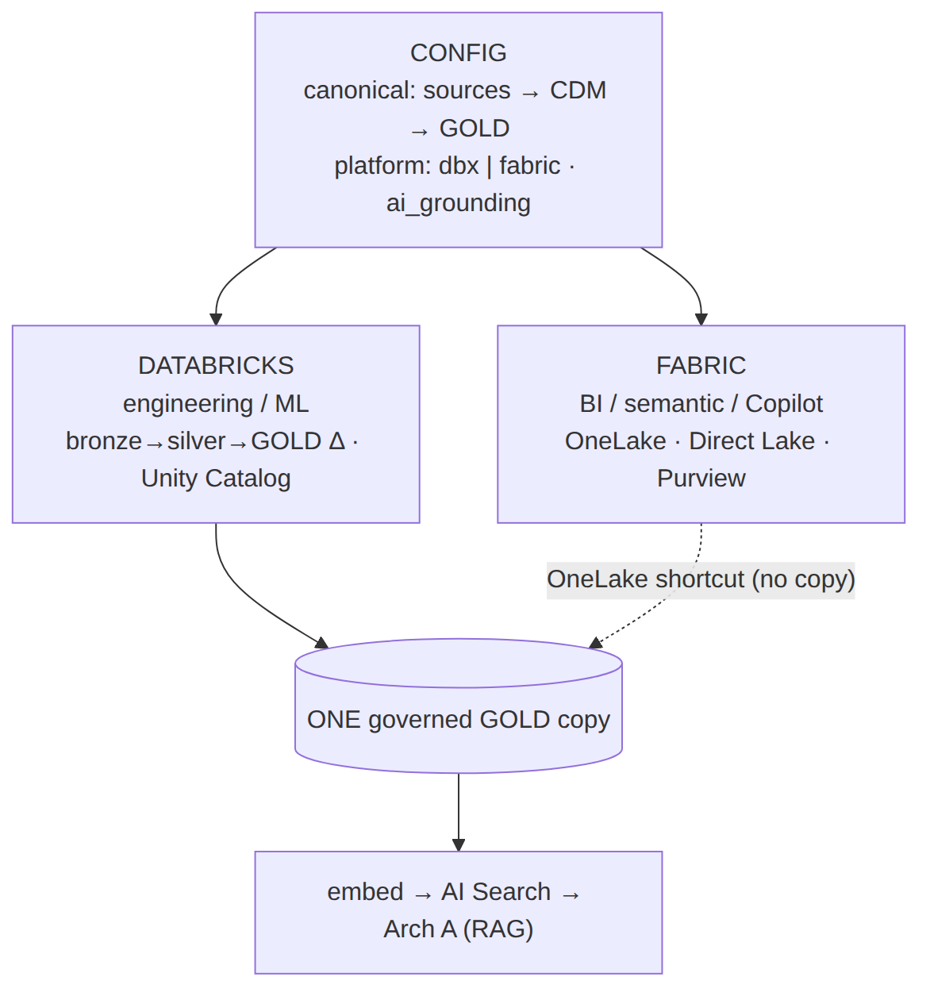

# INTERVIEW PREP — 3Cloud · Principal Solution Architect, Data & AI (Pre-Sales)
**Candidate:** Michael Vogt  •  **Interview:** 2nd round, 60 minutes  •  **Prep date:** 2026-06-17

---

## 0. THE ONE THING YOU CANNOT WALK IN WITHOUT KNOWING

> **Cognizant completed its acquisition of 3Cloud, effective January 1, 2026.**
> 3Cloud is now Cognizant's Microsoft Azure / Data & AI powerhouse — ~1,200 people (700 US)
> folded into Cognizant's global delivery network and industry verticals.

This is the single biggest shift in the conversation since any first round. Signal early that you
know it and have a point of view on it. It plays to your favor:

- **You scale well into a big-SI model.** Your PwC and Capgemini years were exactly this — boutique
  Azure depth operating inside a global firm with industry practices, offshore delivery, and
  enterprise procurement. You've *lived* the model 3Cloud is now becoming.
- **It de-risks you.** A pure boutique might worry you're "too enterprise." Post-Cognizant, your
  enterprise-scale, multi-cloud, governance-heavy background is an asset, not a mismatch.
- **Smart framing:** "The thing that drew me to 3Cloud was the pure-play Azure Data & AI depth and
  the Partner-of-the-Year track record. The Cognizant combination makes it more interesting, not
  less — I've spent years being the deep technical specialist *inside* a global firm. I know how to
  keep boutique-grade solution quality while plugging into global scale, industry IP, and offshore
  delivery. That transition is exactly where solution architects either add leverage or get lost,
  and I know how to add leverage."

**Confirm in the room (don't assume):** how the practice is operating post-close — still the 3Cloud
brand and team, integration timeline, whether the role reports into legacy-3Cloud leadership or a
Cognizant Microsoft Business Group structure. Asking shows you did the homework.

---

## 0.5. ⚠ RESUME ACCURACY — RECONCILE THIS BEFORE YOU WALK IN

Your submitted Data & AI SME resume (2026-06-09) contains two claims that don't match the facts.
**The interviewer will have that resume open.** Fix the resume *and* know the true version cold —
a sharp technical interviewer will ask you to tell the story behind each line.

| Resume currently says | Reality | What to do |
|---|---|---|
| AHEAD: led a **Microsoft Fabric POV** for a healthcare analytics provider that **closed a multi-year Fabric adoption roadmap** | Your only Fabric hands-on was an **SPR** POC for a **medical provider** — Fabric **vs. Azure Databricks** — and **Databricks was chosen** | Recast as an objective competitive POC where you selected Databricks (Story A). Do **not** claim a Fabric win or a Fabric roadmap. |
| AHEAD: governed a **multi-tenant Azure data platform** for a PBM client; governance via **Microsoft Purview** | The PBM platform was on **AWS**, not Azure | Present it as HIPAA/regulated governance depth on AWS whose architecture ports directly to Azure/Purview. Do **not** present it as Azure depth. |

**Strongly recommended: regenerate the resume with these two corrections before the interview.**
(Claude can do this in ~2 minutes — just ask.)

---

## 1. COMPANY SNAPSHOT (facts to have cold)

| Fact | Detail | Why it matters in the room |
|------|--------|----------------------------|
| Identity | "Born in the cloud," Gold Microsoft Azure partner, Azure Expert MSP | They are **Azure-only** — do not pitch yourself as cloud-agnostic |
| Founders | Former Microsoft leaders; strong MS sales/engineering relationships | The MS field-alliance motion matters; co-sell is in their DNA |
| HQ / work model | Downers Grove, IL; role is **virtual-first / flexible location** | You're local (Sugar Grove, IL) — a *soft* plus (Chicago market, can be onsite for client whiteboards), not a differentiator since it's remote-friendly |
| Awards | 2024 **Americas Partner of the Year — Data & AI**; 2025 US Channel Partner of the Year | Reference it as why you're excited; it's their crown jewel and *your* lane |
| Size | ~1,200 employees (700 US) pre-acquisition | Mid-size depth, now global reach |
| Databricks | Formal Databricks partner since 2021 (Azure Databricks) | They are Databricks + Fabric, not Fabric-only — be ready on both |
| Owner (2026) | **Cognizant** (acquisition completed Jan 1, 2026) | See Section 0 |

3Cloud's stated culture: direct and candid feedback, mutual accountability to core values,
"people-first," continuous learning, collaboration. **Translation for the interview:** they reward
people who can be challenged on a design and push back with substance — bring opinions, defend them
with trade-offs, and be comfortable being questioned.

---

## 2. THE ROLE, DECODED  *(updated from the actual JD)*

**Exact title:** *Principal Architect — Data & AI SME.* This is a **pure pre-sales technical
evangelist / trusted-advisor role**, not a delivery-billable role. (An earlier generic 3Cloud
"Principal Architect" posting was delivery-led; **this JD is not** — every responsibility is
pre-sales: evangelize, shape early conversations, partner with sales, qualify, whiteboard, propose,
close, run POVs, drive pipeline, mentor.) **Logistics from the JD:** virtual-first / flexible
location; bonus-eligible (utilization/discretionary); no visa sponsorship (N/A for you); **posting
expires Mon June 22, 2026.**

> **This JD matches your existing "Data & AI SME" resume (2026-06-09) almost word-for-word** — that
> resume scored 22/22 on these exact keywords and was built for this role. You are not improvising;
> you're defending a resume purpose-built for this JD. That's a confidence anchor.

**What this means for your framing — REVERT to the Data & AI SME positioning, NOT the TELUS hybrid:**

- Lead with **technical evangelist + trusted advisor + partner-to-sales**, not "delivery lead." The
  JD never asks you to deliver — it asks you to *convert conversations into winning architectures and
  closed deals* alongside sellers.
- Your delivery track record is now a **credibility asset in service of pre-sales**, not the headline:
  *"I can shape and close it because I've actually built it — so when I tell a CDO this architecture
  is real and will ship, I'm speaking from having shipped it."*
- **Pipeline & deal influence is the metric.** Map directly: SPR $4.5M practice / **$500K+ individual
  deals** (the JD literally requires "$500k+ deal success"), PwC $5M+ program, NVISIA $3M from zero.
- **POVs / innovation workshops / thought leadership** to *expand pipeline* — your SPR Fabric-vs-Databricks
  competitive POC and the SPR Cloud Data Platform Accelerator (cut go-live 40%) are your proof.

**The four things they're testing in a 2nd round for this role:**
1. **Technical depth is real** — can you go deep on Azure Data & AI architecture under questioning?
2. **Pre-sales instinct** — discovery, qualification, whiteboarding, value storytelling, deal closure?
3. **Executive presence** — can you hold a C-suite room and translate practitioner↔C-level?
4. **Culture fit** — candid feedback both ways; player-coach who mentors architects *and* data scientists.

---

## 3. YOUR 60-SECOND POSITIONING (memorize the spine, not the words)

> "I'm a Microsoft Azure Data & AI technical evangelist and trusted advisor who has spent 20+ years
> in consulting and client-service firms doing exactly what this role is — being the deep technical
> person who turns an early client conversation into a winning Azure architecture and partners with
> sales to close it. My platform depth is Microsoft-first — Azure Data Services, Synapse, ADF,
> Azure OpenAI / AI Foundry, and Azure Databricks — built on real engagements at PwC, AHEAD, and SPR.
> I've built two data practices from zero, closed individual engagements over $500K, governed a $5M+
> multi-cloud program with a 50-person team, and led competitive platform POCs — Fabric vs. Azure
> Databricks — plus Databricks lakehouse delivery that drives multi-year roadmap decisions. The 2024
> Data & AI Partner-of-the-Year practice is exactly the bench I
> want to be on — and I happen to be right here in the Chicago market."

Three pillars to keep returning to: **(1) Azure Data & AI technical depth, (2) pre-sales discovery →
whiteboard → POV → close, partnering with sellers, (3) the credibility that I've delivered what I
sell — practice-builder with real $500K+ deal and multi-year-roadmap proof.**

---

## 4. HOW A 60-MINUTE 2ND ROUND USUALLY BREAKS DOWN

Plan your energy against this rough shape (confirm interviewer's name/role beforehand):

| Time | Segment | Your job |
|------|---------|----------|
| 0–5 min | Rapport + "tell me about yourself" | Deliver the 60-sec pitch (Sec 3). Land the local + Data&AI-PoY hooks |
| 5–25 min | Technical depth / architecture | Go deep, use trade-offs, name real platforms (Sec 7, 11) |
| 25–40 min | Pre-sales / scenario / "how would you…" | Run a discovery out loud; structure → options → value (Sec 6, 8) |
| 40–50 min | Behavioral / culture / player-coach | STAR stories (Sec 5); show candor and coaching |
| 50–60 min | Your questions + close | Ask the smart ones (Sec 9); close with intent (Sec 10) |

If it's a panel, expect one technical lead + one delivery/practice leader + possibly a sales/BD
partner. Tailor each answer to who asked: depth for the architect, value/commercials for the seller,
delivery/team for the practice lead.

---

## 5. STORY BANK — STAR stories from your real record (rehearse 5–6 cold)

Each is grounded in your actual resume bullets. Keep them to ~90 seconds: **S**ituation /
**T**ask / **A**ction / **R**esult, then one sentence on *why it matters to 3Cloud*.

**A. Fabric vs. Azure Databricks POC → Databricks selected (SPR, medical provider) — objective trusted advisor + dual-platform fluency.**
You built and ran a hands-on head-to-head proof-of-concept evaluating Microsoft Fabric against Azure
Databricks for a medical provider. You tested both and recommended **Databricks** because it fit
their data-engineering and ML scale and price-performance better — producing the ADR and executive
briefing behind the decision.
→ *3Cloud relevance:* 3Cloud is a **Databricks partner *and* a Fabric shop** — this proves you
evaluate objectively, know both platforms hands-on, and make the call the data supports rather than
forcing a single product. That's the trusted-advisor credibility they sell. (Also your honest,
accurate Fabric story — see §0.5.)

**B. $4.5M practice from zero (SPR) — consumption growth + commercial.**
Built an Azure data & analytics practice from nothing; closed individual engagements **>$500K**
through executive discovery, repeatable estimation/work-planning frameworks, and a Cloud Data
Platform Accelerator that cut go-live timelines **40%**.
→ *3Cloud relevance:* "accelerate Azure consumption" and reusable accelerators are their model.

**C. $5M+ multi-cloud program, team of 50+ (PwC) — scale + governance + C-level.**
Governed a Data-as-a-Product program; originated a domain-driven canonical data model adopted
firm-wide; resolved C-level misalignment on MVP-vs-production quality in real time.
→ *3Cloud relevance:* proves you operate at Cognizant scale and hold the room with executives.

**D. HIPAA multi-tenant platform on AWS (AHEAD) — regulated-data + governance depth.**
PBM client: 3 healthcare orgs, 20+ source systems, 4 domains. Security-by-design — attribute-based
access control for PHI, row-level security, consent-aligned retention, end-to-end lineage and audit.
→ *3Cloud relevance:* deep regulated-industry / HIPAA governance credibility. **Note it's AWS-based**
— frame the governance *architecture* as directly portable to Azure (Purview, Entra ABAC); do **not**
present it as Azure depth (see §0.5).

**E. Platform-selection discipline & ADRs (e.g. Snowflake vs. Redshift) — defend a recommendation to a skeptical CFO.**
You repeatedly produced architecture decision records and executive briefings on price-performance
and competitive positioning that shaped multi-year capital decisions.
→ *3Cloud relevance:* they need architects who can justify platform choices on business terms, not hype.

**F. Roving catalyst / parachute (SPR + NVISIA) — player-coach + account expansion.**
Dropped into in-flight projects to fix architectural misalignment, accelerate stalled builds, and
**expand account scope**; mentored architects as a player-coach.
→ *3Cloud relevance:* the 25-30% "grow opportunities in existing accounts" motion + team coaching.

---

## 6. THE PRE-SALES SCENARIO (high probability — rehearse this live)

Expect some version of: *"A prospect says they want to 'do AI' / modernize their data platform on
Azure. Walk me through how you'd approach it."* Don't jump to architecture. Run the motion:

1. **Discovery first.** "Before I draw anything I'd run a structured discovery — business priorities,
   decision criteria, value drivers, current-state pain, and what 'success in 90 days' looks like to
   them. I tie measurable KPIs to each objective up front." (This is your real AHEAD intake-framework
   bullet — use that exact language.)
2. **Qualify.** Budget, timeline, exec sponsor, data readiness, urgency. Is this a real funded
   opportunity or education? Name that you'd qualify honestly rather than chase.
3. **Frame options, not one answer.** Typically a phased path: govern + land a lakehouse foundation →
   prove a high-value use case (a Power BI / lakehouse win or a GenAI/RAG use case) → expand. Present
   trade-offs (Azure Databricks vs Fabric; Synapse vs Fabric; build vs accelerator) — and lean on
   your real SPR Fabric-vs-Databricks POC as proof you do exactly this.
4. **Prove value fast.** Propose a time-boxed POV with a stakeholder gate and "value early and often."
   Reference your accelerator that cut go-live 40%.
5. **Estimate + staff realistically.** Repeatable estimation for team composition, scope, time/cost.
6. **Tell the value story to the exec.** Business outcomes, technical feasibility, ROI — and the
   Azure consumption + account-expansion path that 3Cloud/Microsoft co-sell rewards.

**The meta-point to say out loud:** "My instinct in pre-sales is to slow down at discovery so the
solution is right, then move fast on a value-proving POV. That's what converts conversations into
multi-year roadmaps." That sentence alone signals a seasoned pre-sales architect.

---

## 7. LIKELY QUESTIONS + ANSWER SCAFFOLDS

**Behavioral / fit**
- *"Why 3Cloud?"* → Azure-only depth + 2024 Data & AI PoY + local + the role is the
  presale-to-delivery hybrid I do best. (Add the Cognizant POV from Sec 0.)
- *"Tell me about a time you disagreed with a client/architect."* → PwC MVP-vs-production C-level
  misalignment story (Story C). Show candor — fits their feedback culture.
- *"How do you mentor / develop architects?"* → Player-coach (Story F); "I look for creative ways to
  leverage each team member's strengths." Be ready for "give me a specific person you grew."
- *"What's a time a deal/POV didn't go your way?"* → Have one honest miss with a lesson. Don't claim
  a flawless record; their culture values candor over polish.

**Pre-sales / commercial**
- *"How do you scope and estimate a Data & AI engagement?"* → Repeatable estimation frameworks;
  team composition, build scope, work planning within time/cost constraints (SPR/AHEAD).
- *"How do you handle a prospect fixated on a tech that's wrong for them?"* → Discovery-first;
  reframe to outcomes; present the ADR-style trade-off; let the business case decide.
- *"How do you grow an existing account?"* → Roving-catalyst expansion (Story F) + land-and-expand
  consumption framing.

**Technical depth — be ready to go 3 layers deep on these (see Sec 11):**
- *"Fabric or Databricks — when do you pick which?"*
- *"How would you architect a production RAG / GenAI app on Azure?"*
- *"How do you do MLOps/LLMOps governance — versioning, eval, safety, human-in-the-loop?"*
- *"Walk me through a lakehouse medallion architecture and your governance layer (Unity Catalog vs
  Purview)."*
- *"How do you handle real-time / streaming on Azure?"* (Event Hubs, Fabric Real-Time Intelligence.)

**Curveballs**
- *"You've been a Director / Exec Director — is Principal Architect a step down?"* → No: this is the
  work I love and do best — being the deepest technical person in the room who also closes and
  ships. Titles in consulting vary; the scope here (principal-level solutioning + delivery + pursuits)
  is exactly my lane, and I want to be hands-on on the best Azure Data & AI bench in the market.
- *"Are you certified on Azure?"* → See Sec 8, RISK 1. Don't bluff.

---

## 8. GAP MANAGEMENT — pre-load these reframes (don't volunteer; be ready)

**RISK 1 — Azure certifications (MEDIUM).** You hold AWS Cloud Practitioner only. A pure-play Azure
shop treats certs as table stakes / partner-tier hygiene (Microsoft partner status depends on
certified headcount). **Reframe:** "My Azure depth is from real enterprise delivery — Synapse, ADF,
Azure Data Services, Purview (PwC), Azure Databricks, and Azure OpenAI. I'm formalizing it with
AZ-305 (Solutions Architect Expert) and the DP-600/Fabric Analytics Engineer cert." **Action before
interview:** at minimum, *schedule* AZ-305 or DP-600 so you can say "I'm sitting AZ-305 on [date]." A
booked date converts a gap into momentum and shows you understand partner economics.

**RISK 2 — Microsoft Fabric hands-on depth (MEDIUM — they WILL probe it).** Your only hands-on Fabric
is the SPR head-to-head POC where you evaluated Fabric vs. Azure Databricks and selected Databricks.
**Do NOT overclaim Fabric** (and fix the resume — §0.5). **Honest framing (it's a strong one):** "My
hands-on Fabric is a head-to-head POC I ran for a medical provider — I built and tested Fabric
against Azure Databricks and recommended Databricks because it fit their engineering and ML scale
better. So I know Fabric's architecture and where it wins — BI-led estates, OneLake single-copy,
Direct Lake semantic models — and where it doesn't. My deep lakehouse delivery is Databricks, and I
track the Fabric roadmap closely because it's moving fast." This shows objectivity and dual-platform
command — which a Databricks-partner-and-Fabric shop respects more than someone forcing Fabric on
every client.

**RISK 3 — Snowflake hands-on (LOW for 3Cloud).** They're Azure Databricks + Fabric, so Snowflake
matters less here than at TELUS. Your Azure Databricks depth (Unity Catalog, Delta, PySpark) is
the relevant one — lead with it. If Snowflake comes up: "I've done the competitive eval work
(Snowflake vs Redshift, Fabric vs Databricks) — I know the trade-offs cold; my hands-on lakehouse
delivery is Databricks."

**RISK 4 — Azure OpenAI / AI Foundry hands-on depth (LOW-MEDIUM).** Your GenAI is architectural +
local-equivalent (vLLM, RAG, multi-agent, Qdrant). **Reframe — and it's a strong one:** "I run a
production AI-native platform hands-on — local GPU inference, RAG pipelines, multi-agent
orchestration, knowledge graphs. Those are the exact patterns Azure OpenAI Service and AI Foundry
implement; I've built them at the metal, so I understand the architecture deeper than someone who's
only called the managed API." This turns a potential gap into a credibility *gain* — but only if you
can speak fluently about it (see Sec 11).

**RISK 5 — Pre-sales-via-practice-building vs. embedded-with-sellers (LOW).** You built practices
(owned P&L + BD) rather than sitting next to a dedicated MS-aligned seller. **Reframe:** "I've done
the whole BD motion myself, so partnering *with* a sales team is the easier version — I bring the
technical credibility that converts, they bring the relationship and quota. I know exactly where the
architect adds leverage in a pursuit because I've owned the whole thing."

**RISK 6 — Post-acquisition uncertainty (NEUTRAL — turn into a question).** Don't show anxiety about
the Cognizant deal. Show curiosity (Sec 9). It signals you're thinking like an insider.

---

## 9. SMART QUESTIONS TO ASK THEM (pick 3–4; have 6 ready)

1. "Post-Cognizant, how is the Data & AI practice operating day-to-day — still the 3Cloud team and
   brand, and how does the role plug into Cognizant's Microsoft Business Group and industry verticals?"
2. "As a pre-sales SME, how do you measure success for this role — pipeline influenced, POVs run,
   win rate, deals closed? And how is the SME paired with sellers and delivery architects on a pursuit?"
3. "Where's the Data & AI demand concentrated this year — Fabric migrations, Databricks lakehouse,
   or GenAI/agentic build-outs? Where do you most need a principal to go deep?"
4. "How does the practice use accelerators / reusable IP in pursuits today? I built one at SPR that
   cut go-live 40% and I'd want to contribute to that motion."
5. "What does the first 90 days look like for a principal here, and what would 'this hire is working'
   look like to you at 6 months?"
6. "How do you balance Microsoft co-sell / Azure-consumption goals with picking the genuinely right
   architecture for the client? I want to understand where that tension lives here."

Avoid: comp/PTO/remote-policy (save for offer stage), anything answerable by their website.

---

## 10. CLOSE (the last 2 minutes earn the offer)

- Restate fit in one line: *"This is the role I do best — deep Azure Data & AI architecture, the
  presale-to-delivery bridge, and a practice I can help grow. I'm local, I'm Microsoft-deep, and I'm
  genuinely excited about the bench post-Cognizant."*
- Ask about **next steps and timeline** explicitly.
- One candid forward-looking line: *"If there's any area you'd want me to go deeper on before a next
  conversation, tell me now and I'll come back sharp on it."* (Invites the candor they value.)
- Send a same-day thank-you that references one specific thing discussed.

---

## 11. TECHNICAL CHEAT SHEET (skim 30 min before — be able to defend each)

**Fabric vs. Azure Databricks — when to pick which (the question they WILL ask):**
- **Microsoft Fabric** — best when the client is Power BI-centric, wants a unified SaaS analytics
  estate, OneLake single-copy storage, Direct Lake semantic models, business-user empowerment, lower
  ops overhead. Strong for BI modernization and "one platform" mandates. Newer for heavy data
  engineering / large-scale ML.
- **Azure Databricks** — best for serious data engineering and ML/AI at scale: Unity Catalog
  governance, Delta Lake, PySpark, MLflow, model serving, mature lakehouse + advanced ML/LLM
  workloads. Pick when ML maturity and engineering scale dominate.
- **The mature answer:** "It's not either/or — many enterprises run Databricks for engineering/ML
  and Fabric for the BI/semantic layer over the same OneLake/Delta data. I drive the choice from the
  client's center of gravity: BI-led and SaaS-simplicity → Fabric; engineering/ML-led and scale →
  Databricks; often both, governed coherently."
- **Your real proof:** you ran exactly this Fabric-vs-Databricks POC at SPR for a medical provider
  and chose Databricks — cite it. It's honest, on-brand for a Databricks-partner shop, and shows you
  decide on evidence, not product loyalty.

**Production RAG / GenAI on Azure (have a clean reference architecture in your head):**
Ingest + chunk + embed → vector store (Azure AI Search / Cosmos DB / managed vector) → retrieval →
Azure OpenAI (GPT-4o / o-series) generation → orchestration (prompt flow / Semantic Kernel / agent
framework) → grounding on governed canonical data → eval + telemetry + prompt/response logging +
safety controls + human-in-the-loop gates. Map each to what you've built locally (vLLM, Qdrant,
ArangoDB knowledge graph, multi-agent orchestration) to prove hands-on depth.

**Agentic AI:** multi-agent orchestration, tool use, planner/executor patterns, guardrails, eval
loops — you operate this daily. Tie to Azure AI Foundry agent capabilities + Copilot Studio.

**MLOps / LLMOps governance:** model/data versioning, experiment tracking, evaluation telemetry,
prompt/response logging, safety controls, human-in-the-loop review gates, CI/CD for pipelines —
aligned to **Microsoft Responsible AI**. Containerized (Docker/Kubernetes) model serving.

**Lakehouse / medallion:** bronze→silver→gold, Delta Lake, governance via **Unity Catalog**
(Databricks) and/or **Microsoft Purview** (estate-wide catalog/lineage/classification, RBAC/ABAC).
Be ready to explain when you'd use which and how they coexist.

**Streaming / real-time:** Azure Event Hubs / Kafka ingestion; Fabric Real-Time Intelligence /
Synapse / Stream Analytics processing; Delta for the landing layer.

**Azure Data & AI stack to name fluently:** ADF, Synapse Analytics, ADLS Gen2, Microsoft Fabric
(OneLake, Fabric Pipelines, Direct Lake, Power BI Premium), Azure Databricks (Unity Catalog, Delta,
PySpark), Azure OpenAI Service, Azure AI Foundry (formerly AI Studio), Azure Machine Learning,
Prompt Flow, Microsoft Purview, Azure AI Search, Copilot Studio.

**Governance / regulated (your differentiator):** HIPAA/FHIR/PBM, ABAC/RLS for PHI, consent-aligned
retention, encryption/key management, end-to-end lineage + audit, data quality validation,
stewardship. (PBM platform was AWS — the governance architecture maps 1:1 to Azure Purview + Entra;
Purview hands-on is from PwC.)

---

## 12. NIGHT-BEFORE CHECKLIST
- [ ] Re-read Sec 0 (Cognizant) + Sec 3 (60-sec pitch) until automatic
- [ ] Rehearse Stories A, B, C aloud; have D, E, F ready
- [ ] Decide and schedule AZ-305 or DP-600 so you have a date to cite
- [ ] Skim Sec 11 cheat sheet; be able to give the Fabric-vs-Databricks answer cold
- [ ] Confirm interviewer name(s)/role(s); look them up on LinkedIn
- [ ] Prepare 4 questions from Sec 9 on paper
- [ ] Test video/audio/lighting if remote; have resume + this guide open off-camera

---

## 13. WHITEBOARD-READY APPENDIX (draw these in 60 seconds)

If they hand you a marker, you draw two things. Keep them this simple; narrate the detail.

**(A) Production RAG/GenAI on Azure — the 6-box version:**

```
 Client ─► API Mgmt ─► Orchestrator ─► [ AI Search (hybrid: vector+keyword+rerank) ]
 (Entra)   (authN,      (AI Foundry/    [ + Cosmos GraphRAG ]  ──► grounding
           throttle)     Sem.Kernel)    ──► Azure OpenAI (GPT-4o + embeddings)
                              │                       ▲
                              ▼                       │ ingest: chunk→embed→dual-write
                    Content Safety + Purview     GOVERNED GOLD data products
                    + eval loop + Monitor        (from the data platform ↓)
```


Say while drawing: *"discovery of intent → hybrid retrieval, confidence-gated → grounded generation
→ safety + groundedness eval on the way out → everything logged. Purview governs what's allowed into
the index; Content Safety guards in and out."*

**(B) Config-driven data platform → which engine:**

```
   ┌ CONFIG (canonical model: sources→CDM→GOLD + platform: dbx|fabric + ai_grounding) ┐
   │                                                                                   │
 DATABRICKS (engineering/ML)        FABRIC (BI/semantic/Copilot)        HYBRID (both)
 bronze→silver→GOLD Δ               OneLake medallion, Direct Lake      DBX builds GOLD once;
 Unity Catalog                      Purview + domains                   Fabric reads via OneLake
                       └──────────► ONE governed GOLD copy ◄────────────┘ shortcut (no copy)
                                          │
                                          ▼  embed → AI Search → Arch A (RAG)
```


One-breath decision: *"Engineering/ML-led → Databricks. BI-led, SaaS-simple → Fabric. Most large
enterprises → Hybrid: Databricks engineers it, Fabric serves it over one OneLake copy, GenAI grounds
on that single governed gold — and it stays a **config** decision, so it's reversible. That's the
Fabric-vs-Databricks evaluation I actually ran, where the data pointed to Databricks."*

> Full detail: `working-docs/architecture/Azure_RAG_GenAI_reference_architecture_2026-06-17` +
> `Azure_ConfigDriven_DataPlatform_variants_2026-06-17` (+ Mermaid + cost/sizing).

---

**Sources:** Cognizant–3Cloud acquisition (completed Jan 1, 2026); 3Cloud Microsoft Partner-of-the-Year
Data & AI awards; 3Cloud Principal Architect role description (delivery-led + ~25-30% pre-sales);
3Cloud–Databricks partnership; 3Cloud careers/culture pages. Verify live details with the recruiter.
Grounded in your AHEAD/PwC/SPR/NVISIA experience (Data & AI SME resume, 2026-06-09).
